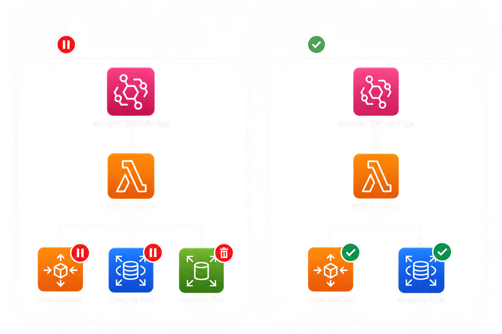
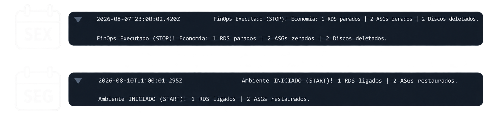
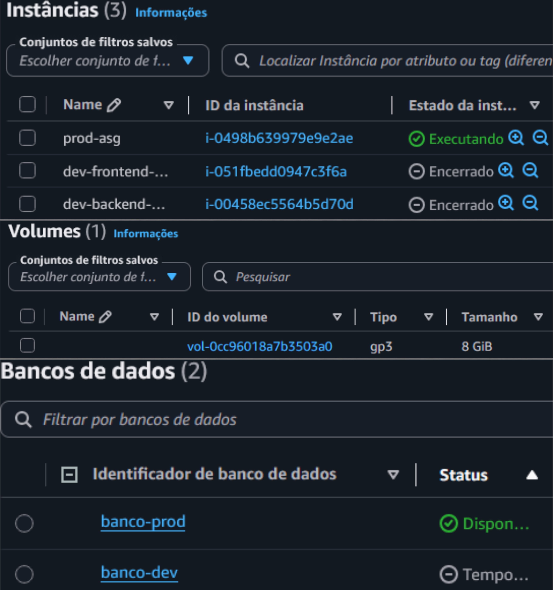

# FinOps AWS: Redução Automática de Custos

Solução serverless para desligamento programado de recursos ociosos e remoção de volumes desanexados em ambientes de desenvolvimento.


## Sobre

Ambientes de desenvolvimento frequentemente mantêm recursos ativos fora do expediente e acumulam volumes desanexados, gerando gastos extras na AWS.

Este projeto automatiza a parada de instâncias RDS e a redução do Auto Scaling Group para zero fora do horário comercial, além de remover volumes EBS desanexados (`status = available`) com criação prévia de snapshot (retenção de 14 dias). A rotina filtra exclusivamente recursos com a tag `ambiente=dev`, mantendo a infraestrutura de produção inalterada.

## Arquitetura

A automação opera via agendamentos no Amazon EventBridge com Dead-Letter Queue (Amazon SQS):

* **Sexta-feira (20h BRT / 23h UTC):** Reduz o Auto Scaling Group para zero, pausa o RDS, remove snapshots com mais de 14 dias e exclui volumes EBS desanexados (com snapshot prévio).
* **Segunda-feira (08h BRT / 11h UTC):** Restaura a capacidade do Auto Scaling Group e inicia o RDS.

<p align="center">
  
</p>

### Componentes
* **Terraform:** Provisionamento da infraestrutura e funções serverless.
* **AWS Lambda & Python (Boto3):** Execução dos scripts de parada, inicialização e limpeza.
* **Amazon EventBridge:** Agendamento dos disparos semanais.
* **Amazon SQS:** Dead-Letter Queue (DLQ) para mensagens com falha.
* **Amazon CloudWatch & Amazon SNS:** Logs, alarmes métricos e notificações por e-mail.
* **AWS IAM & AWS KMS:** Controle de permissões e chave KMS para criptografia do RDS (`storage_encrypted = true`).
* **Amazon EC2, Auto Scaling, EBS e RDS:** Recursos gerenciados pela solução.

## Pré-requisitos

* [Terraform](https://developer.hashicorp.com/terraform/downloads) v1.5+
* [AWS CLI](https://aws.amazon.com/cli/) instalado e configurado (`aws configure`)

## Deploy

```bash
cd terraform
terraform init
terraform plan
terraform apply -auto-approve
```

## Configuração

Crie o arquivo `terraform/terraform.tfvars` com as credenciais do banco de dados e o e-mail de alertas:

```hcl
db_username = "<SEU_USUARIO_DB>"
db_password = "<SUA_SENHA_FORTE_DB>"
alert_email = "<SEU_EMAIL_DE_ALERTAS>" # Opcional: para notificações SNS de falhas na DLQ
```

## Uso

A automação executa via EventBridge nos horários agendados. Para acionamento manual via AWS CLI:

```bash
# Parada e limpeza de EBS desanexados
aws lambda invoke --function-name lambda-stop-dev --region us-east-2 response_stop.json

# Inicialização e restauração do ambiente
aws lambda invoke --function-name lambda-start-dev --region us-east-2 response_start.json
```

### Evidências

#### 1. Estado Inicial
Ambiente ativo durante o expediente: instâncias no Auto Scaling Group, banco RDS online e volumes EBS desanexados.

<p align="center">
  
</p>

#### 2. Logs de Execução
Logs no CloudWatch confirmando filtragem por tags e remoção dos volumes EBS desanexados.

<p align="center">
  
</p>

#### 3. Estado Final
Auto Scaling Group zerado, RDS pausado e redução de volumes EBS ativos de 5 para 1 volume.

<p align="center">
  
</p>

## Teardown

Para remover todos os recursos criados e evitar cobranças adicionais:

```bash
terraform destroy -auto-approve
```

